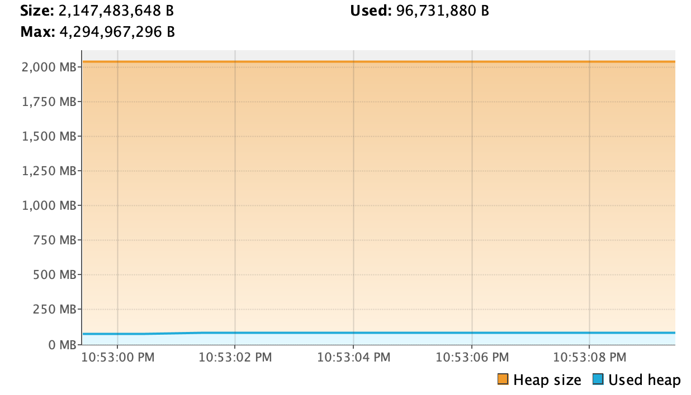
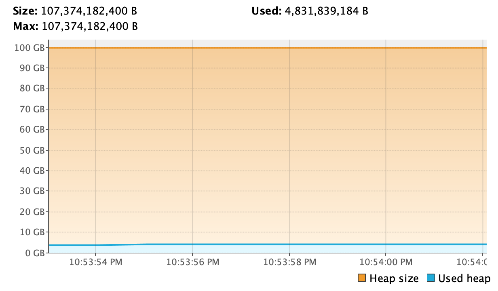

While at work, we were fine tuning some java application, to do that, we were setting up jvm options, such as `-Xmx`, `-Xms` and so on. That lead me to asking me the following question:

> What would happen if you start the jvm with the minimum memory to be higher than the computer memory?

Our initial assumption is that `-Xms` will try to reserve the specified amount of memory. If that is bigger than computer memory, the JVM will stop with a `OutOfMemoryError` and/or the SO will start swapping and of course cause really poor performance.

## Setting up

To answer that question, I prepared a little experiment. A very silly gradle to project that prints something:

<a href="https://github.com/adriangalera/jvm-big-xms">[https://github.com/adriangalera/jvm-big-xms](https://github.com/adriangalera/jvm-big-xms)</a>

Basically it runs this dummy code:

```java
public class Boom {

    public static void main(String[] args) throws InterruptedException {
        while (true) {
            System.out.println("I'm here");
            Thread.sleep(1000);
        }
    }
}
```

And then, generate the jar file:

```shell
./gradlew build
```

## First experiment

First thing to do is run in a controlled environment, let's say with 2 GB of initial memory:

```shell
java -Xms2G -jar build/libs/boom-1.0-SNAPSHOT.jar
```

The program is responding, the memory profile seems fine; everything works as expected:



## Let's go wild!

Now, I'll try with more memory than the available for the computer:

```shell
java -Xms100G -jar build/libs/boom-1.0-SNAPSHOT.jar
```

Program is responding, and checking the memory profile I got a surprise: **it is reporting 100GB!**



After some discussion with some collegues, we agreed that this did not explode at the begining because the JVM is using virtual memory. In Linux setup this allocated in 64 bit for userland processes.

The initial assumption also was wrong about swap, we check swap usage and was completely normal.

Therefore, the JVM does not really reserve the initial memory as it seems initially.

## Let's break it

If we want to actually pre reserve the memory, there's a jvm option for that:

```shell
java -XX:+AlwaysPreTouch -Xms100g -jar build/libs/boom-1.0-SNAPSHOT.jar
```

Executing this, the computer will become unusable because the JVM is taking the whole memory and the SO is taking the rest of the swap disk.
