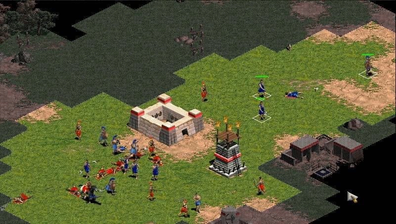
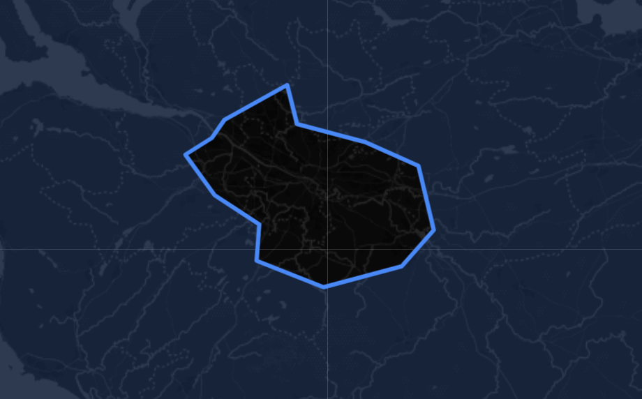

<style>
iframe {
    padding: 0;
    border-width: 0;
    width: 60%;
    height: 400px
}

.iframe-holder {
    display: flex;
    align-items: center;
    justify-content: center;
    padding-bottom: 5px;
}
</style>

When I was playing age of empires the map was all in black color at the beginning. As long as you explore the map, the black color is removed discovering what it was hidden behind.

I wanted to implement something similar to show all the trails, routes, paths, roads, streets, etc that I have discovered. I'll describe the callenges I have found in a series of articles.

<p><!--more--></p>

This is part of my series of articles about leaflet:

- <a href="/leaflet-fog-of-war">Leaflet fog of war</a>
- <a href="/leaflet-draw-polygon-markers">Draw a polygon from markers in leaflet</a>
- <a href="/leaflet-load-gpx">Load and display GPX in leaflet</a>
- <a href="/browser-storage">Browser storage</a>

Age of empires... what a great game



I want to create something similar to the map in Age of Empires. A map where everything is hidden until you discovered. This way you could check how much of your city you know, or where to search for new places to visit.

I have worked many times before with <a href="https://leafletjs.com/">leaflet js</a>, a nice library to display maps and geographic information. It has a nice ecosystem of plugins, so I've checked if someone has something similar implemented and YES!

<a href="https://github.com/ptma/Leaflet.Mask">Leaflet.Mask</a> already implemented a plugin that mask all the map and displays the area specified in the begining.

<div class="iframe-holder">
<iframe src="https://ptma.github.io/Leaflet.Mask/examples/mask.html"></iframe>
</div>

However, it does not fit my requirements as I want to add places dynamically. So, let's implement our own thing ...

## Implementing my own Leaflet Mask

Taking <a href="https://github.com/ptma/Leaflet.Mask">Leaflet.Mask</a> as a base, I will modify it a bit in order to be able to add the visited area dynamically.

The key for this to succeed was to understand how the polygon has to be created in leaflet:

```javascript
scotland = L.polygon([
	[
		[60, -13],
		[60, 0],
		[50, 4],
		[50, -13]
	],
	[
		[55.7, -4.5],
		[56, -4.5],
		[56, -4],
		[55.7, -4]
	]
])
scotland.addTo(map)
```



In order to draw the polygon, the user might pass the list of latitude longitudes and a second optional argument that defines the holes of that polygon.

Finally the code looked something similar to:

```javascript
 _setMaskLayer: function () {
            if (this.masklayer) {
                this.removeLayer(this.masklayer)
            }

            var allWorld = this._coordsToLatLngs(this._allWorldCoordinates)
            var latlngs = [allWorld]

            this._holes.forEach((hole) => latlngs.push(this._coordsToLatLngs(hole)))

            var layer = new L.Polygon(latlngs, this.options);
            this.masklayer = layer
            this.addLayer(layer);
        },
```

The plugin reads the input data as <a href="https://en.wikipedia.org/wiki/GeoJSON">GeoJSON</a> and store the visited places latitude and longitude in the `this._holes` variable. Later on, this array is iterated in order to build the holes that leaflet will draw into the polygon. Finally the created polygon is added to the map. When the method is called, the polygon is removed to be able to redraw it.

Here you can see it in action: <a href="https://www.agalera.eu/leaflet-fogofwar/" target="_blank" rel="noopener">https://www.agalera.eu/leaflet-fogofwar/</a>

But wait ... that's not all, I want the fulfill the following requirements:

- I need a way to draw the areas I visisted, covered in the article: <a href="/leaflet-draw-polygon-markers/">Draw a polygon from markers in leaflet</a>
- Load a GPX and display it in the map, covered in the article: <a href="/leaflet-draw-polygon-markers/">Load and display GPX in leaflet</a>
- I don't want to spent any money in this, so the storage will be browser based. This is covered in the article: <a href="/browser-storage">Browser storage</a>
