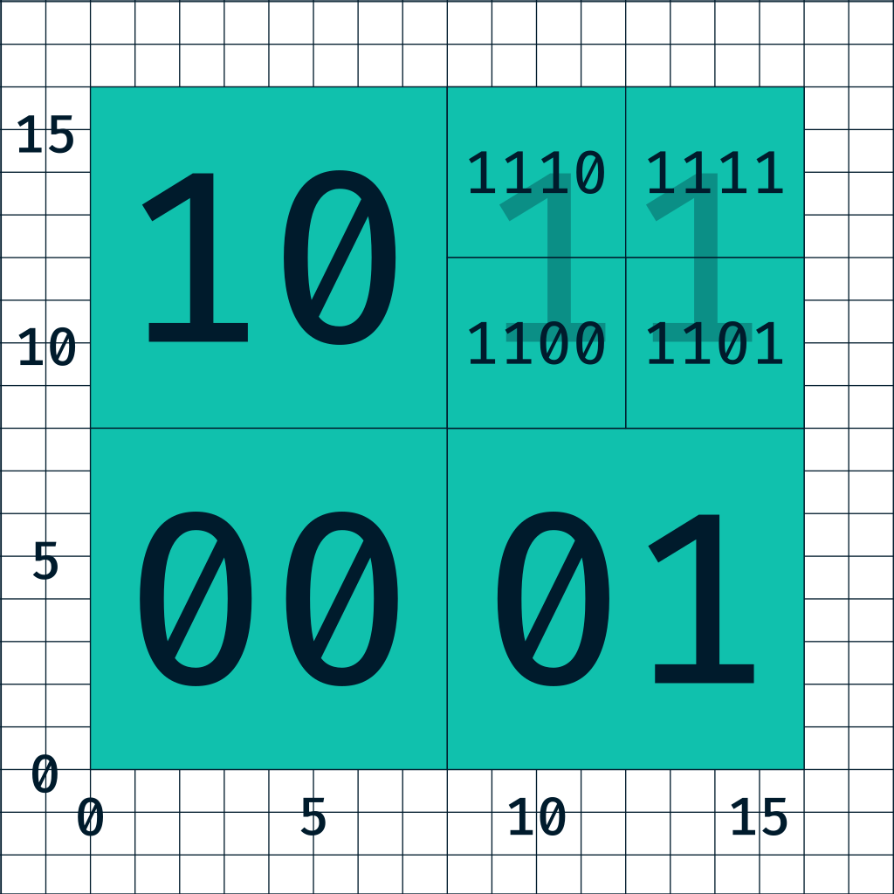

As shown in the past articles:

- [https://www.agalera.eu/leaflet-load-gpx/](https://www.agalera.eu/leaflet-load-gpx/)
- [https://www.agalera.eu/leaflet-fog-of-war/](https://www.agalera.eu/leaflet-fog-of-war/)
- [https://www.agalera.eu/download-all-tracks-from-suunto/](https://www.agalera.eu/download-all-tracks-from-suunto/)

I am building an application to display all my tracks in a map, to find new places to discover. You can find it here: [https://agalera.eu/leaflet-fogofwar](https://agalera.eu/leaflet-fogofwar)

Everything went well, but since I mostly ran in the same places usually, these places are over-represented in the map. So, in this articles I will tackle the problem of how to discard the repeated points that are common to many tracks.

If I had to accumulate in memory every points and check the following track points against them, the problem will quickly become impossible, let's think a bit on the numbers:

Let's suppose a track has 2000 points and that I have aprox. 800 tracks, that would mean that for every new track I had to perform aprox. 2M comparisons.

Does not sound too much, but with the team the algorithm will become very slow. In terms of complexity (big O notation), this algorithm will be O(n^2) since we need to compare every point of the track with the already seen points. Therefore, we need a more solid solution

## Meet the Quadtree

The [Quadtree](https://en.wikipedia.org/wiki/Quadtree 'Quadtree') is a special data structure that will help speeding up searches. The speed up comes from the fact that storing the points in a specialised structure, the algorithm can skip a lot of unnecessary compare operations.

The Quadtree is a tree in which every node contains a list of values (if leaf node) or 4 points to the children nodes (if branch node).

Every node has a defined capacity, if the node contains less than maximum capacity, it is a leaf node and the search will be performed in the list of values. When the node exceeds the maximum capacity, the space is subdivided into 4 and will create 4 child nodes (leaf).

See this example:



This structure is very efficient to perform searches since O(n) searches will only be performed in leaf nodes, which will contain a limited amount of nodes.

The implementation of this data structure seems daunting, but fear not! Just make sure to do some small unit test as long as you develop the data structure and everything will be fine:

```javascript
test('quad tree can find point before splitting', () => {
	const qt = QuadTreeNode.empty()
	qt.insert(new LngLat(0, 0))
	qt.insert(new LngLat(10, 10))
	expect(qt.locationIsOnTree(0, 0, 0)).toBe(true)
	expect(qt.locationIsOnTree(1, 1, 0)).toBe(false)
})
test('quad tree can find point after split', () => {
	const maxCapacity = 2
	const qt = QuadTreeNode.empty(maxCapacity)
	qt.insert(new LngLat(0, 0))
	qt.insert(new LngLat(0, 1))

	expect(qt.hasChildNodes()).toBe(true)
	expect(qt.locationIsOnTree(0, 0, 0)).toBe(true)
})
```

For example, these two test cases test that the search works fine for both leaf and branch node.

## Display points instead of tracks

The first attempt to deduplicate points involved re-using the previous code. For every track a quadtree was built, and every track was compared versus the list of queadtrees.

If more than 80% of points were already included in the quadtree, the tracks were merged. How? Just by adding the different points and appending them to the reference quadtree and re-build the quadtree.

Everything looked good until the display phase. In the display, the library to display GPX in leaflet failed to display the track correctly because in the merge process I removed the time coordinate and the library struggles to find the order of the points of the track.

At this point, I changed the strategy, instead of showing tracks and keep a list of unique quadtress, I will build a single quadtree that contains all the points.

After adding all the track points into the quad tree, I need to retrieve them,

```javascript
points() {
  let points = []
  for (let p of this.values) {
    points.push([p.lat, p.lng])
  }

  this._addPoints(this.northEastChild, points)
  this._addPoints(this.northWestChild, points)
  this._addPoints(this.southEastChild, points)
  this._addPoints(this.southWestChild, points)
  return points
}
_addPoints(x, points) {
  if (x) {
    for (let pointPair of x.points()) {
      points.push(pointPair)
    }
  }
}
```

convert them to GeoJSON:

```javascript
const savePointsToFile = (points, filePath) => {
	let geojson = `
{
  "type": "FeatureCollection",
  "features": [
`
	points.forEach((point) => {
		geojson += `
    {
      "type": "Feature",
      "geometry": {
        "type": "Point",
        "coordinates": [${point[1]}, ${point[0]}]
      }
    },
    `
	})
	// remove last comma:
	geojson = geojson.substring(0, geojson.length - 6)
	geojson += `]}`

	fs.writeFileSync(filePath, geojson)
}
```

and display them:

By deduplicating the points the output file size has gone from 250MB to 30MB. If the file is minified, the file size shrinks to 17MB, this means a 93% reduction of size.

You can find the code here: [https://github.com/adriangalera/leaflet-fogofwar](https://github.com/adriangalera/leaflet-fogofwar)
