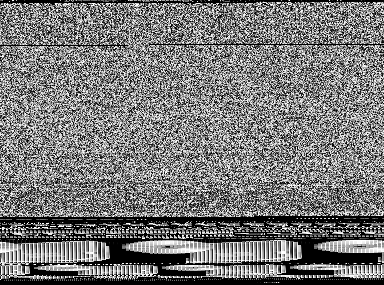
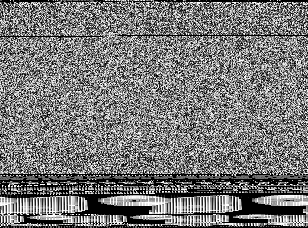
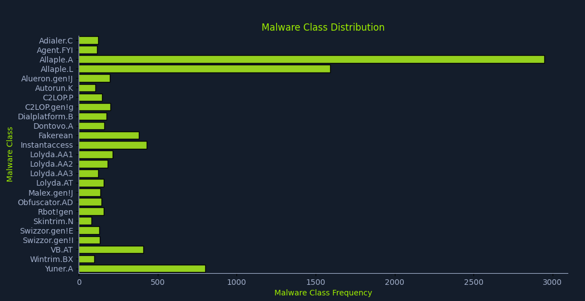

This post continues with the series of articles related with Hack the box academy module about using AI for information security tasks. This time is about malware analysis using machine learning.

Managing malware is potentially harmful, if the payload gets executed, our own computer will be infected, potentially causing a huge harm.

In this article, a malware classifier will be built based on the proposal of this [paper](https://arxiv.org/pdf/2010.16108). The main idea is the malware payload will be converted into a grey-scale image. The payload binary is grouped by bytes (that goes from 0 to 256 integer value), in the next stage, the bytes are converted into pixels of an image, effectively generating an image that represents exactly the contents of the malware.

Dealing with the image instead of the payload binary is safe, since the image will not be executed.

Surprisingly families of similar malware show a similar image signature. The following example represents two payload of `FakeRean`malware family. While it's not the same picture, we can similar patterns.

|  |  |
| ---------------------------------------------------------------- | ---------------------------------------------------------------- |

## The dataset

The dataset of images can be obtained from [kaggle.](https://www.kaggle.com/api/v1/datasets/download/ikrambenabd/malimg-original)

It is a zip file with a bunch of malware families and a bunch of image of the payloads. The following code provides an histogram to see the counts of the different malware families in the dataset:

```python
# Explore the dataset
import os
import matplotlib.pyplot as plt
import seaborn as sns

DATA_BASE_PATH = "./malimg_paper_dataset_imgs/"

# compute the class distribution
dist = {}
for mlw_class in os.listdir(DATA_BASE_PATH):
    mlw_dir = os.path.join(DATA_BASE_PATH, mlw_class)
    dist[mlw_class] = len(os.listdir(mlw_dir))

# plot the class distribution

# HTB Color Palette
htb_green = "#9FEF00"
node_black = "#141D2B"
hacker_grey = "#A4B1CD"

# data
classes = list(dist.keys())
frequencies = list(dist.values())

# plot
plt.figure(facecolor=node_black)
sns.barplot(y=classes, x=frequencies, edgecolor = "black", orient='h', color=htb_green)
plt.title("Malware Class Distribution", color=htb_green)
plt.xlabel("Malware Class Frequency", color=htb_green)
plt.ylabel("Malware Class", color=htb_green)
plt.xticks(color=hacker_grey)
plt.yticks(color=hacker_grey)
ax = plt.gca()
ax.set_facecolor(node_black)
ax.spines['bottom'].set_color(hacker_grey)
ax.spines['top'].set_color(node_black)
ax.spines['right'].set_color(node_black)
ax.spines['left'].set_color(hacker_grey)
plt.show()
```



## Convolutional Neural Networks

This is an image classification task and Convolutional Neural Networks (CNNs) are the perfect tool for this. This type of neural networks provide a hierarchical analysis of the images where the first layers of the network detect simple shapes and following layers detect more complex features of the images.

The term convolutional comes from a mathematical concept. The convolution is an operation where a function is compared with another function and the output is how the first function shape is modified by the second function.

Since each neuron is interested in one particular feature, each network will apply a convolution to reveal how the input image reacts to the feature convolution function. This allow the neural network to extract many different features of the image.

## Preparing the dataset

Similar to other scenarios, the input data needs to be transformed so that it fits the expectations of the model. In this case, we are dealing with image files inside folders (used as labels).

In the other scenarios, the dataset was loaded in memory and split within the program itself. However, in this case we cannot do that, instead we'll rely on a library that will split the files dataset for us:

```python
import splitfolders

DATA_BASE_PATH = "./malimg_paper_dataset_imgs/"
TARGET_BASE_PATH = "./newdata/"

TRAINING_RATIO = 0.8
TEST_RATIO = 1 - TRAINING_RATIO

splitfolders.ratio(input=DATA_BASE_PATH, output=TARGET_BASE_PATH, ratio=(TRAINING_RATIO, 0, TEST_RATIO))
```

The data will be in the newdata folder and split according to the passed ratio.

Now the data needs to be adapted to be processed via the CNN:

```python
from torchvision import transforms

# Define preprocessing transforms
transform = transforms.Compose([
	transforms.Resize((75, 75)),
    transforms.ToTensor(),
    transforms.Normalize(mean=[0.485, 0.456, 0.406], std=[0.229, 0.224, 0.225])
])
```

First the image is resized to an standard image size of 75x75 pixels. This is a trade-off between image detail (information) and performance (smaller images are easier to process). Also CNN require image of uniform size.

Later the image format is change to tensor. This moves the values from 0 to 255 to 0 to 1 and re-arrange the channels to the format tensorflow expects.

Lastly, the image is normalized by substracting the mean for each channel and dividing it by the standard deviation. These are standard normalization values used for pre-trained models.

After that, tensorflow requires some specific way of defining how the data will be loaded. The following function implements the logic to combine the dataset transformations and the tensorflow loaders:

```python
def load_datasets(base_path, train_batch_size, test_batch_size):
    # Define preprocessing transforms
    transform = transforms.Compose([
        transforms.Resize((75, 75)),
        transforms.ToTensor(),
        transforms.Normalize(mean=[0.485, 0.456, 0.406], std=[0.229, 0.224, 0.225])
    ])

    # Load training and test datasets
    train_dataset = ImageFolder(
        root=os.path.join(base_path, "train"),
        transform=transform
    )

    test_dataset = ImageFolder(
        root=os.path.join(base_path, "test"),
        transform=transform
    )

    # Create data loaders
    train_loader = DataLoader(
        train_dataset,
        batch_size=train_batch_size,
        shuffle=True,
        num_workers=2
    )

    test_loader = DataLoader(
        test_dataset,
        batch_size=test_batch_size,
        shuffle=False,
        num_workers=2
    )

    n_classes = len(train_dataset.classes)
    return train_loader, test_loader, n_classes
```

## Creating the CNN

In order to simplify the things and speed up training time, we'll be using a pre-trained CNN called ResNet50. The model has 50 layers and 23 milion parameters. The model is really strong in image classification, so it's a perfect fit for our needs.

To speed up the training process, we'll rely on the pre-defined weights of the CNN as the baseline for the training. We'll then pass the training dataset to compute the weights of the CNN through the forward and backward propagation technique.

To simplify things even more, we'll only compute the weights of the output layer of the CNN. Of course, the length of the output layer needs to be adjusted to the number of classes we have in the dataset.

The following class implements such CNN:

```python
import torch.nn as nn
import torchvision.models as models

#The original final layer of ResNet-50 is designed to output 1000 ImageNet classes.
HIDDEN_LAYER_SIZE = 1000

class MalwareClassifier(nn.Module):
    def __init__(self, n_classes):
        super(MalwareClassifier, self).__init__()
        # Load pretrained ResNet50
        self.resnet = models.resnet50(weights='DEFAULT')

        # Freeze ResNet parameters
        for param in self.resnet.parameters():
            param.requires_grad = False

        # Replace the last fully connected layer
        num_features = self.resnet.fc.in_features
        self.resnet.fc = nn.Sequential(
            nn.Linear(num_features, HIDDEN_LAYER_SIZE),
            nn.ReLU(),
            nn.Linear(HIDDEN_LAYER_SIZE, n_classes)
        )

    def forward(self, x):
        return self.resnet(x)
```

## Training the model

Now we need to specify the loss function and the optimizer to train the model and train the model using forward and backward propagation, compute the loss function and optimize the gradient using the optimizer to reduce the loss at each step. The following code captures the training process:

```python
import torch
import time

def train(model, train_loader, n_epochs, verbose=False):
    model.train()
    criterion = torch.nn.CrossEntropyLoss()
    optimizer = torch.optim.Adam(model.parameters())

    training_data = {"accuracy": [], "loss": []}

    for epoch in range(n_epochs):
        running_loss = 0
        n_total = 0
        n_correct = 0
        checkpoint = time.time() * 1000

        for inputs, labels in train_loader:
            optimizer.zero_grad()
            outputs = model(inputs)
            loss = criterion(outputs, labels)
            loss.backward()
            optimizer.step()

            _, predicted = outputs.max(1)
            n_total += labels.size(0)
            n_correct += predicted.eq(labels).sum().item()
            running_loss += loss.item()

        epoch_loss = running_loss / len(train_loader)
        epoch_duration = int(time.time() * 1000 - checkpoint)
        epoch_accuracy = compute_accuracy(n_correct, n_total)

        training_data["accuracy"].append(epoch_accuracy)
        training_data["loss"].append(epoch_loss)

        if verbose:
            print(f"[i] Epoch {epoch+1} of {n_epochs}: Acc: {epoch_accuracy:.2f}% Loss: {epoch_loss:.4f} (Took {epoch_duration} ms).")

    return training_data

def compute_accuracy(n_correct, n_total):
    return round(100 * n_correct / n_total, 2)
```

When the model is trained, we should see an output like:

```
[i] Starting Training...
[i] Epoch 1 of 10: Acc: 60.52% Loss: 1.4468 (Took 69302 ms).
[i] Epoch 2 of 10: Acc: 87.71% Loss: 0.4122 (Took 67878 ms).
[i] Epoch 3 of 10: Acc: 90.44% Loss: 0.2690 (Took 66773 ms).
[i] Epoch 4 of 10: Acc: 92.40% Loss: 0.2167 (Took 61625 ms).
[i] Epoch 5 of 10: Acc: 93.98% Loss: 0.1738 (Took 62859 ms).
[i] Epoch 6 of 10: Acc: 93.70% Loss: 0.1691 (Took 225566 ms).
[i] Epoch 7 of 10: Acc: 94.14% Loss: 0.1593 (Took 188704 ms).
[i] Epoch 8 of 10: Acc: 96.05% Loss: 0.1161 (Took 60817 ms).
[i] Epoch 9 of 10: Acc: 96.80% Loss: 0.1037 (Took 60946 ms).
[i] Epoch 10 of 10: Acc: 96.59% Loss: 0.0977 (Took 60999 ms).
```

Each time the forward-backward propagation process happens, the overall accuracy of the CNN is improved and the loss is minimized.

## Model evaluation

Once the model is trained with the training set, we need to evaluate how well it generalizes to unseen data. We do so by telling the model to don't optimize for gradient and to be in eval mode:

```python
def predict(model, test_data):
    model.eval()

    with torch.no_grad():
        output = model(test_data)
        _, predicted = torch.max(output.data, 1)

    return predicted

def evaluate(model, test_loader):
    model.eval()

    n_correct = 0
    n_total = 0

    with torch.no_grad():
        for data, target in test_loader:
            predicted = predict(model, data)
            n_total += target.size(0)
            n_correct += (predicted == target).sum().item()

    accuracy = compute_accuracy(n_correct, n_total)

    return accuracy
```

The achieved accuracy is quite low, around 86%, however this was only a proof-of-concept.

If more accuracy is required, we should go an train all the weights of the CNN which will increase a lot the training time specially without GPUs.

When we're satisfied with the results, we can save the model:

```python
def save_model(model, path):
	model_scripted = torch.jit.script(model)
	model_scripted.save(path)
```
