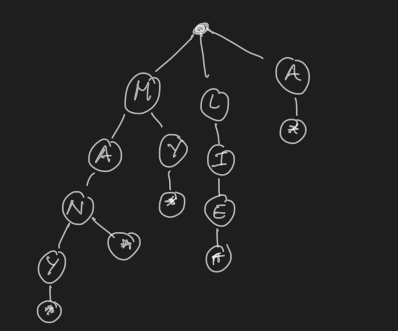
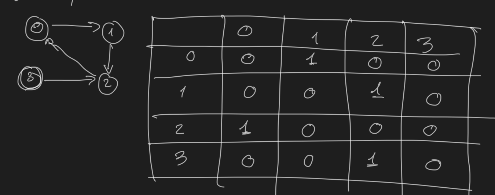
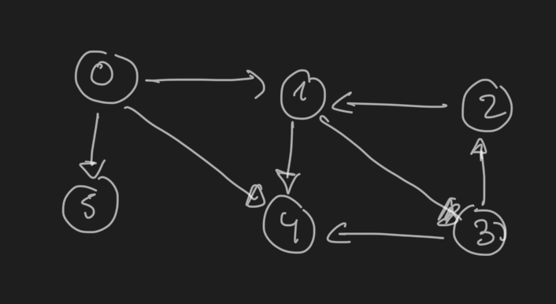

I've started looking for a new software engineering job. I haven't performed interviews for a while, so I decided I'll study the typical recommended books: [Cracking the code interview](https://www.crackingthecodinginterview.com/) and [Alex Xu's System Design Inteview](https://www.amazon.com/System-Design-Interview-Insiders-Guide-ebook/dp/B08B3FWYBX).

I'll use my blog to post the lessons learnt while studying these books.

## Topics to explore

This table contains a list of topics that I'll explore and master:

|                        |               |                                 |
| ---------------------- | ------------- | ------------------------------- |
| Linked list            | BFS           | Bit manipulation                |
| Tree, Tries and Graphs | DFS           | Memory: stack vs heap           |
| Heaps                  | Binary search | Recursion                       |
| ArrayList              | Merge sort    | Dynamic Programming             |
| Hashtable              | Quick sort    | Big O notation (time and space) |

## Workflow to solve coding problems

1. Listen (or read) carefully the problems and understand **exactly** what they are asking for.
2. Be very cautious with the provided examples, are they special cases? Are they useful? Are they big enough?
3. Brute-force a solution on paper. At this point, we should find a non-optimal solution that solves the problem. We'll have a baseline algorithm to compare.
4. Now it is time to optimize. Remember the acronym **BUD**: search for _bottlenecks_, _unnecessary work_ and _duplicated work_. Make sure to read the statement again, most of the times, the key for finding the optimal algorithm is in the statement.
5. Once you have the idea, write it in pseudo-code and walk through it to completely understand it.
6. Implement the code
7. Test it. Make sure to include extensive examples and depending on the problem add extreme cases (null, very big numbers, etc..).

## Optimization techniques

There are some techniques to optimise an algorithm on paper:

- Do it yourself on real life: solve the problem on paper and later reverse engineer the steps needed to write a code that implements it.
- Simply and generalise: e.g: your problem mentions words, what'll happen if you change words for characters?
- Base case and build: start by the base case and increase the complexity. For example, start with the first iteration (n=0), what would happen if the next iteration(n=1). This is very useful for recursion.
- Data structure base case: try to think on how would you solve the problem using several data structures: would a stack help somehow on the problem, etc...

## Hashtable

A hashtable is a data structure capable of retrieving data in O(1) in best case.

It consist on a list of lists.

It retrieves the data by:

1. Compute the hashcode of the input. A hashcode as an integer value that summarises somehow the input. It must be consistent, i.e. returns the same output for the same input.
2. Now map the hashcode to the index of the list of lists by performing the modulo operation `123 % 5` if the hashtable has 5 lists.
3. Store or retrieve from the list specified in the last step.

Best case: O(1)
Worst case: O(n)

## ArrayList

Is a data structure that provides an array with dynamic sizing.

The simplest implementation is to double the size of the array when the array is full. It does it by creating a different array and copy the values of the previous array.

While this might seem a loose of time, if we take a look into the amortized time complexity, these copies operations will still be worthy as each time it is harder to have a full array and therefore hard to make the copies.

Best case: O(1)
Worst case: O(n)

## String Builder

Is a data structure that enables to build strings efficiently. If you build new string by just concatenatting them, the string values need to be copied over and over, ending up on O(n^2) complexity. With String Builder, the complexity is reduced to O(n).

## Strings

Most of the problems related with Strings boils down to counting characters.

There are special case of Strings problems related with palyndromes. A palyndrome is a string that reads the same forward and backward. If you take a closer look, in order to have a palyndrome, you need to split the string in three parts parts: `A + O + A*`.

- A is a string
- O is a character that can exist or not
- A\* is reversed A

In general, in order to know if you have a palyndrome or not, you can just count characters. A palyndrome must have all characters even except only one. Example:

| Scenario               | Character counts              | Palyndrome         |
| ---------------------- | ----------------------------- | ------------------ |
| Only one odd character | c1: 2 c2: 2 c3: 2 c4: 1 c5: 1 | c1c2c3c4c5c4c3c2c1 |
| No odd character       | c1: 2 c2: 2                   | c1c2c2c1           |

Another special case of string problems is checking is a string is substring of another. In some of these cases, it might useful to append the string with itself while performing the check. Example:

s1 = xy
s2 = yx

s2 is substring of s1s1: `xyxy`.

## Linked list

A linked list is useful to have O(1) inserts at the head. Also access to the head is O(1). Access to a particular node is O(n).

Each node of the list has a pointer to the next node of list (single-linked list). A node can have both pointers to the successor and predecessor (double-linked list).

To solve the problems, you can use:

- Runner techniques: you can have multiple cursors iterating over the same linked list.
- Recursive technique: usually it's simple to use recursion to iterate over the linked list. The base case is quite simple (next node is null).

## Stacks

A stack is a data structure to keep `Least In First Out` (LIFO) order.

Let's image we input the following data to the stack: 1,2,3,4,5

The order of the items extracted from the stack will be: 5,4,3,2,1

The insertion/access/delete of the head is O(1).

The typical implementation contains the following functions:

- `pop()`: remove from the top
- `push(item)`: adds an item to the top
- `peek()`: returns the top of the stack but does not remove the element.
- `isEmpty()`: returns true if the stack is empty.

This data structure is very useful for recursion. The typical example is when backtracking is needed. Or to implement the typical `Undo` algorithm.

## Queue

It is the opposite of the stack. It keeps the items in `First In First Out` order (FIFO).

Let's image we input the following data to the stack: 1,2,3,4,5.

The order of the items extracted from the stack will be: 1,2,3,4,5.

The typical implementation contains the following functions:

- `add(item)`: adds an item to the queue to the start of the queue.
- `remove()`: removes the item from the end of the queue.
- `peek()`: returns the item at the end of the queue (but does not remove it).
- `isEmpty()`: returns true if there are no elements in the queue.

This data structure is very useful for BFS; we'll keep the non visited neighbours in a queue.

A typical exercise is to build a queue by using two stacks. It's easy if you think about the LIFO-FIFO order. You can insert items in a stack and when you need to remove them, move them to another stack and extract from the second stack.

## Tree

A tree is a dataseries of connected nodes without cycles. Each node can have 0 or N child nodes.

A node is considered a `leaf` node, if it does not have child nodes.

A `binary tree` is a tree where each node has two child nodes (except the leaf nodes).

A `binary search tree` is a special case of binary tree where the nodes are sorted so that:

All nodes on the left <= n > All nodes on the right.

It's super simple and efficient to perform searches on a binary search tree. Since each time it's dividing the search space by two, the search can be performed in O(log n).

## Heap (min/max)

There are special case of binary trees called `min-heap` or `max-heap`. In this kind of trees, the minimum element (or maximum) are kept on the top, achieving access to the min or max in O(1).

While the access is O(1), the insert and remove operations take O(log n) since the tree needs to be rebalanced. Below you can find an example of a min-heap:

```text
      1
     / \
    3   5
   / \
  7   9
```

## Trie

A `trie` is a special case of trees where each node stores a character. They are some sort of prefix trees. Each path in the tree represents a word, as seen in the image .

The typical use case of a trie is to load a dictionary and perform prefix lookups. The lookup performance is O(k) where k is the length of the string passed.

## Graph

The graph is the generalization of a tree. While the tree couldn't have cycles, the graph does.

In general a graph is a set of different nodes with edges that connect them. Can be directed (can go from A to B but not from A to B), or undirected (can go from A to B and from B to A).

A graph can be represented in the code with a collection of nodes with points to the neighboring nodes:

```java
class Graph{
    Node[] nodes
}

class Node{
    Node[] children
}
```

Or it can be expressed also in the code with an adjacency matrix:

.

There are two major algorithms to perform search in graphs (and in any kind of tree).

## Depth First Search (DFS)

In this algorithm we explore completely every branch of the graph before going to the next one. In a tree is very easy to observe since we reach the leaf nodes performing the search.

Let's take this graph as example:

.

In DFS we will visit the nodes in this order:

```text
- Node 0
 - Node 1
   - Node 3
     - Node 2
     - Node 4
  - Node 5
```

DFS is simple to implement and it is very useful when we want to explore all the nodes looking for something.

The pseudo-code to implement DFS looks like this:

```python
def search(node):
  if node is None: return None
  visit(node)
  node.visited = True
  for n in node.children:
    if not n.visited:
      search(n)
```

`visit(node)` is a generic operation, in case of a search it will be comparing if the node meets certain criteria.

## Breadth First Search (BFS)

In BFS search, we can start at any arbitrary node of the graph (or root in case of tree). The search algorithm first will explore the neighbours before diving into child nodes. When there are no more neighbors to explore, it will dive into the children.

For the previous graph example:

.

BFS will explore the nodes in the following order (supposing we start at 0):

- Node 0
- Node 1 (and add Node 3 for visiting later)
- Node 4
- Node 5
  - Node 3 (and add Node 2 for visiting later)
    - Node 2

BFS is useful for computing shortest paths, in general when we don't need to actually search in all the possible nodes.

The pseudo-code to implement BFS looks like this:

```python
def search(node):
  q = Queue()
  node.queued=true
  q.addToEnd(node)

  while not q.empty():
    ng = q.getFromFront()
    visit(ng)
    for adj in ng.adjacents():
      if not adj.queued:
        adj.queued = true
        q.addToEnd(adj)
```

## Memory (heap vs stack)

This section talks about memory management, not to be confused with heap data structure.

The stack memory works like a stack data structure. It is a very fast LIFO memory. It is used to store function calls, local variables and function parameters.

Each call creates a stack frame and adds it to the stack memory.

This memory does not need any kind of management, the frames are removed automatically when the function ends.

That's why in case of not controlled recursion the famous stack overflow error appears: the stack memory is full before there's a bunch of unfinished function executions.

In contrast, heap memory is a large pool of memory used for dynamic allocation; e.g: objects, arrays in general anything that can be created dynamically ( `new`, `malloc`, etc..).

It is slower than the stack and it requires management (explicit removal or garbage collection).

## Bloom filter

A bloom filter is a efficient space probabilisitc algorithm that determines if a element belongs to a set.

False positive matches are possible but false negatives are not. It means that if the algorithm say the element it's not there, for sure it will not be there.

In other words, a query returns either "possibly in set" or "definitely not in set".

A Bloom filter uses a bit array of size m and k hash functions.

To add an item:

1. Hash the item k times, each hash gives an index in the bit array
2. Set the bits that correspond to the indexes to 1.

To check if an item is in the set:

1. Hash the item k times. And store the indexes
2. If any correspond bit is 0, the item is definitely not in the set.
3. Otherwise, the item is \*probably+ in the set.
