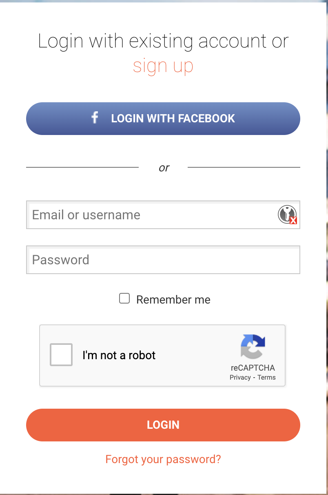

If you have a Suunto watch, you'll know the Suunto App. In that app, you can see all your tracks and workouts. However, it's very difficult to retrieve your data back: you'll need to download all your workouts one by one.

I wanted to print in a map all the tracks I've registered in that platform. Retrieving all the tracks one by one, it will take me a long time. Instead, I will automate the process of retrieving them.

After some investigation, it turns out the Suunto App, it just a nice representation of the data stored in [https://www.sports-tracker.com/dashboard](https://www.sports-tracker.com/dashboard). The credentials are exactly the same as in the application.

I get inspired by the work done in [https://ivanderevianko.com/2016/04/export-all-workouts-from-sports-tracker](https://ivanderevianko.com/2016/04/export-all-workouts-from-sports-tracker). In this article, the author runs some JS code directly in the browser to download all the workouts. However, I want to automate all the process by using [https://playwright.dev/](https://playwright.dev/python/)

## Evading the captcha

The first problem to solve is shown in this screenshot



If we are not careful with the actions implemented in the automation process, the captcha will detect the bot and will show some challenge to resolve: typically identify some cars, semaphores, etc... There are some paying services to solve those challenges. However, I don't want to spent a cent and I'll look for alternative way.

It turns out, there is a plugin for pupetter and playwright named **_stealth_**. [https://www.npmjs.com/package/puppeteer-extra-plugin-stealth](https://www.npmjs.com/package/puppeteer-extra-plugin-stealth). This plugin will try to mimc human behaviour to avoid bot detection:

```javascript
// playwright-extra is a drop-in replacement for playwright,
// it augments the installed playwright with plugin functionality
const { chromium } = require('playwright-extra')

// Load the stealth plugin and use defaults (all tricks to hide playwright usage)
// Note: playwright-extra is compatible with most puppeteer-extra plugins
const stealth = require('puppeteer-extra-plugin-stealth')()

// Add the plugin to playwright (any number of plugins can be added)
chromium.use(stealth)

// That's it, the rest is playwright usage as normal 😊
chromium.launch({ headless: true }).then(async (browser) => {
	const page = await browser.newPage()

	console.log('Testing the stealth plugin..')
	await page.goto('https://bot.sannysoft.com', { waitUntil: 'networkidle' })
	await page.screenshot({ path: 'stealth.png', fullPage: true })

	console.log('All done, check the screenshot. ✨')
	await browser.close()
})
```

After some tests, the captcha still triggers when the text is filled in too fast. Makes sense, so if we put a delay between username and password input and accepting the captcha the bot will not be detected:

```javascript
const login = async (page) => {
	const username = await read.read({
		prompt: 'Username: '
	})
	await page.locator('#username').pressSequentially(username)
	await page.waitForTimeout(2000)
	const password = await read.read({
		prompt: 'Password: ',
		silent: true,
		replace: '*'
	})
	await page.getByPlaceholder('Password').pressSequentially(password)
	await page.waitForTimeout(2000)
	await aceptCaptcha(page)
	await page.waitForTimeout(500)
	await page.locator('#content > div > form > input.submit').click()
}
const aceptCaptcha = async (page) => {
	const captchaFrame = page.mainFrame().childFrames()[0]
	await captchaFrame.waitForSelector('.recaptcha-checkbox-border')
	const elementHandle = await captchaFrame.$('.recaptcha-checkbox-border')
	elementHandle.click()
}
```

Additionally, the username and password is asked to the user via stdin. This will add a realistic delay inadvertently to the user.

## Extracting the IDs

When the user enters the dashboard, the most recent 40 workouts are shown. In the bottom of the page, there's a Show more button. When clicked, the app will load 40 more workouts. That's quite easy to automate:

```javascript
const displayAllWorkouts = async (page) => {
	let workoutCount = 0
	let workouts = await extractIds(page)
	let allLoaded = false
	while (!allLoaded) {
		try {
			const showMoreButton = page.locator(
				'#content > div > div.diary-list > div.diary-list__list.diary-list__ordered-by-date > div'
			)
			await showMoreButton.click()
		} catch (err) {} //the last iteration the button disappear and cause a timeout
		console.log('Loaded workouts: ' + workouts.length)
		await page.waitForTimeout(500)
		workouts = await extractIds(page)
		allLoaded = workouts.length > 0 && workouts.length == workoutCount
		workoutCount = workouts.length
	}
	console.log('All workouts displayed ...')
}
const extractIds = async (page) => {
	const ids = await page.evaluate(() => {
		let ids = []
		const items = document.querySelectorAll('ul.diary-list__workouts li a')
		for (let i = 0; i < items.length; i++) {
			const href = items[i].getAttribute('href')
			const id = href.substr(href.lastIndexOf('/') + 1, 24)
			ids.push(id)
		}
		return ids
	})
	return ids
}
```

The algorithm is simple:

1. Extract the ID of the current workouts (we'll need this to download the tracks later)
2. Count the current workouts
3. Click the Show more button
4. Extract the IDs of the loaded workouts and count the extracted workouts
5. Repeat until both workout counters are equal. This means no new workouts are loaded therefore all the workouts are loaded.

## Downloading the workouts

In the webpage, when we click in a workout to download the GPX, it will trigger a call to an API. To authenticate the API calls, sportstracker uses a Token, that it's accessible via JS because is stored in the cookies:

```javascript
const extractToken = async (page) => {
	console.log('Extracting token ...')
	const downloadToken = await page.evaluate(() => {
		const key = 'sessionkey='
		const valueStartIndex = document.cookie.indexOf(key) + key.length
		return document.cookie.substring(valueStartIndex, document.cookie.indexOf(';', valueStartIndex))
	})
	return downloadToken
}
```

Once the token is obtained, we can proceed to download every workout:

```javascript
const downloadGpx = (id, current, total, token) => {
	const url = `https://api.sports-tracker.com/apiserver/v1/workout/exportGpx/${id}?token=${token}`
	https
		.get(url, (res) => {
			const fileName = `./gpx/${id}.gpx`

			if (res.statusCode == 200) {
				const file = fs.createWriteStream(fileName)
				res.pipe(file)
				file.on('finish', () => {
					file.close()
					console.log(`GPX downloaded: ${fileName} (${current}/${total})`)
				})
				return
			}

			console.log(`Error downloading ${fileName}: `, res.statusCode, res.statusMessage)
		})
		.on('error', (err) => {
			console.log(`Error downloading ${fileName}: `, err.message)
		})
}
```

You can find the complete code here: [https://github.com/adriangalera/leaflet-fogofwar/tree/main/scripts](https://github.com/adriangalera/leaflet-fogofwar/tree/main/scripts)
