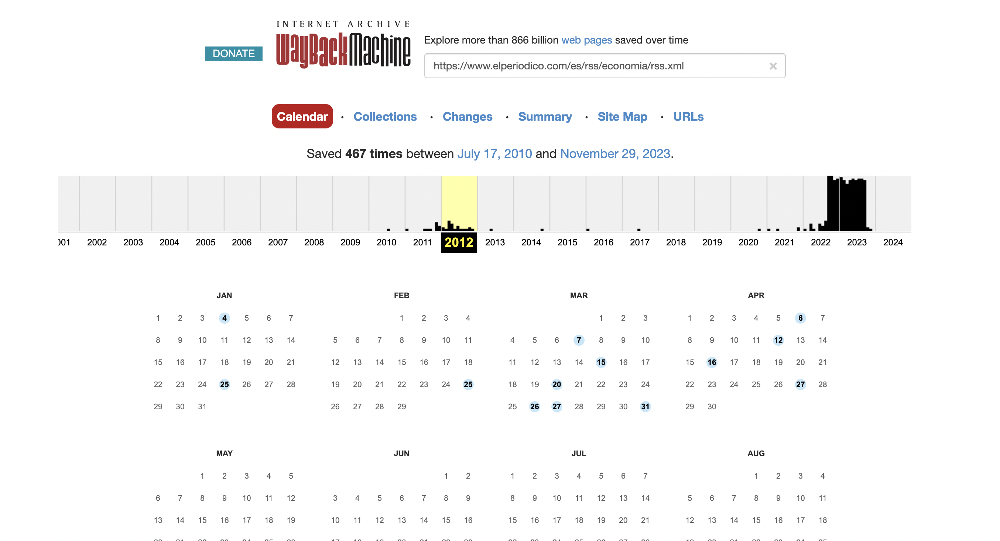

I'm doing a machine learning project regarding text analysis. In order to do so, I need to train a dataset and in order to retrieve the dataset I plan to use some news headlines coming in RSS feeds.

I can do a script to download them, however it will take ages until I get a decent amount of data. If I could download historical data of those feeds, it will speed up the process a lot.

It turns out, there's this might project named Internet Archive which periodically analyse many websites in Internet and stores a copy to keep some sort of archive. Well, it turns out the RSS feeds I'm interested in have been scanned by Internet Archive bots and there are many historical copies available.

However, downloading them manually it will be a very tedious task. So, I automated the download process. The process can be splitted in two parts: collecting the internet archive URLs and actually downloading them.

It's important to separate the retrieval and the downloading of the URLs because downloading is very error-prone and might need several retries due to the nature of how Internet Archive is implemented.

## Collecting the URL

Let's take this feed as example: [https://www.elperiodico.com/es/rss/economia/rss.xml](https://www.elperiodico.com/es/rss/economia/rss.xml).

We can go manually to internet archive and search the copies available:



If you click in the days with data, you are able to download the historic copy of the feed.

This process can be automated using python's playwright library.

```python
from playwright.sync_api import sync_playwright
import argparse

def retrieve_list_of_urls(page):
    try:
        page.wait_for_selector(".calendar-day", timeout=5_000)
    except Exception: #for some years it might not be any copy, the timeout exception need to be ignored in this case
        pass
    js = "Array.from(document.getElementsByClassName('calendar-day')).map(c => c.children[1]).map(l => l.href)"
    return page.evaluate(f"() => {js}")

def retrieve_urls_from_wayback_machine(page, url):
    page.get_by_placeholder("Enter a URL or words related").fill(url)
    page.keyboard.press("Enter")

    urls = []

    years = [str(i) for i in range(2010, 2025)]
    for year in years:
        page.get_by_text(year, exact=True).click()
        urls_year = retrieve_list_of_urls(page)
        urls.extend(urls_year)

    return urls


def read_urls(url_files):
    urls = []
    with open(url_files, 'r') as f:
        for line in f.readlines():
            urls.append(line.rstrip())
    return urls


if __name__ == '__main__':

    parser = argparse.ArgumentParser()
    parser.add_argument(dest='url_file',
                        help="A file containg the URLs to search in wayback machine")
    parser.add_argument('--disable-headless', dest="disable_headless", action="store_true", required=False, default=False,
                        help="Disable headless mode")
    args = parser.parse_args()

    urls = read_urls(args.url_file)

    with sync_playwright() as p:
        browser = p.chromium.launch(headless=not args.disable_headless)
        page = browser.new_page()
        page.goto("https://web.archive.org/")
        for url in urls:
            historic_urls = retrieve_urls_from_wayback_machine(page, url)
            for h_url in historic_urls:
                print(h_url)

```

This piece of code accepts a file containing a list of URLs where each line is a URL. For every URL, it will go to Internet Archive and print all the URLs available from 2010.

Usage example:

```shell
python3 dataset/extractors/wayback/retrieve-urls-wayback-machine.py dataset/extractors/wayback/feeds.txt > dataset/extractors/wayback/historic-urls.txt
```

## Downloading the copy

Once the list of historic URL has been generated by the previous script we need to download them.

We need to do it very carefully, otherwise Internet Archive will cut down our connection temporary to don't overload them.

I've created a script that accounts for errors and retry them with some sleeping time:

```shell
#/bin/bash
# Downloads a list URLs with a sleep time
URL_FILE=$1
DOWNLOAD_FOLDER=$2
SLEEP_TIME=1
while read url; do
  DATE=$(echo "$url" | awk -F'/' '{print $5}')
  FILENAME=$(echo "$url" | awk -F'/' '{print $NF}')
  mkdir -p $DOWNLOAD_FOLDER/$DATE
  DEST_FILE="$DOWNLOAD_FOLDER/$DATE/$FILENAME"
  if [ -f "$DEST_FILE" ]; then
    echo "$DEST_FILE exists."
  else
        wget -q $url -O $DEST_FILE --retry-connrefused --waitretry=5 --read-timeout=20 --timeout=15 --tries 20
        ERR=$?
        if [ $ERR -ne 0 ]; then
          echo "Cound't download $DEST_FILE"
          exit $ERR
        else
          FILESIZE=$(stat -f%z "$DEST_FILE")
          echo "$DEST_FILE: downloaded $FILESIZE bytes"
          sleep $SLEEP_TIME
        fi
    fi
done <$URL_FILE
```

If Internet Archive will shutdown the connection, the retry options of wget will get the job done. The process is slow but it will eventually download all the URLs collected in the first stage.

Usage example:

```shell
./dataset/extractors/wayback/download.sh ./dataset/extractors/wayback/historic-urls.txt ./dataset/feeds
```

If the file has been already downloaded, no calls to Internet Archive will be performed.
