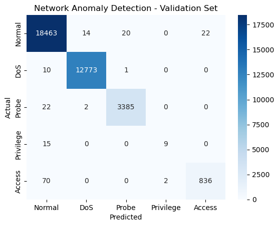

This post continues with the series of articles related with Hack the box academy module about using AI for information security tasks.

This time is about detecting network anomalies using machine learning. Anomaly detection algorithms detect data points that deviate from the norm. This presents an interesting usage in InfoSec, as network traffic deviates from the norm when a cyber attack is ongoing. Therefore, observing anomalies in network traffic is a very good indicator of a cyber attack which can serve the basis as an IDS (Intrusion Detection System).

## Dataset

For this task, we'll use the NSL-KDD dataset which is a standard dataset used to measure the performance of various IDS. The dataset contains both attack and normal traffic statistics labelled with attack or normal. It also includes attack types, so it allow our algorithm to perform not just binary classification but also multi-class classification.

The following code downloads and explores the dataset:

```python
import requests, zipfile, io

# URL for the NSL-KDD dataset
url = "https://academy.hackthebox.com/storage/modules/292/KDD_dataset.zip"

# Download the zip file and extract its contents
response = requests.get(url)
z = zipfile.ZipFile(io.BytesIO(response.content))
z.extractall('.')  # Extracts to the current directory

import numpy as np
import pandas as pd
from sklearn.ensemble import RandomForestClassifier
from sklearn.model_selection import train_test_split
from sklearn.metrics import accuracy_score, precision_score, recall_score, f1_score, confusion_matrix, classification_report
import seaborn as sns
import matplotlib.pyplot as plt

# Set the file path to the dataset
file_path = r'KDD+.txt'

# Define the column names corresponding to the NSL-KDD dataset
columns = [
    'duration', 'protocol_type', 'service', 'flag', 'src_bytes', 'dst_bytes',
    'land', 'wrong_fragment', 'urgent', 'hot', 'num_failed_logins', 'logged_in',
    'num_compromised', 'root_shell', 'su_attempted', 'num_root', 'num_file_creations',
    'num_shells', 'num_access_files', 'num_outbound_cmds', 'is_host_login', 'is_guest_login',
    'count', 'srv_count', 'serror_rate', 'srv_serror_rate', 'rerror_rate', 'srv_rerror_rate',
    'same_srv_rate', 'diff_srv_rate', 'srv_diff_host_rate', 'dst_host_count', 'dst_host_srv_count',
    'dst_host_same_srv_rate', 'dst_host_diff_srv_rate', 'dst_host_same_src_port_rate',
    'dst_host_srv_diff_host_rate', 'dst_host_serror_rate', 'dst_host_srv_serror_rate',
    'dst_host_rerror_rate', 'dst_host_srv_rerror_rate', 'attack', 'level'
]

# Read the combined NSL-KDD dataset into a DataFrame
df = pd.read_csv(file_path, names=columns)

print(df.head())
```

As seen, one can define custom names for the columns of the dataset.

## Random Forest

To actually perform the classification, we'll use Random Forest Classifier model. Random Forest are a huge combination of decision trees.

Each layer in the decision tree uses certain feature to decide if the passed input belongs to one class or the other or to pass the input to the next layer. When the input finally arrives to a leaf node the output is the predicted class of the input.

A random forest is build from many decision trees, For each tree, a random subset of features is considered at every split, ensuring diversity and reducing correlations among trees. When the classification is done, each tree votes for a class, and the most voted class wins.

For anomaly detection, the random forest is trained exclusively with normal data. Each data that does not fit the normal data class (or does it with a very low confidence), will be detected as an anomaly.

## Cleaning and preparing the data

As in another machine learning tasks, the models are prepared to work with specific data format, so we need to change our input data to what the model expects.

### From category data to binary data

Attack or normal labels are text based. We can transform this data to binary:

```python
# Maps normal traffic to 0 and any type of attack to 1
df['attack_flag'] = df['attack'].apply(lambda a: 0 if a == 'normal' else 1)
```

This can be extended to low cardinality data such as protocol_type(tcp,udp,icmp) or service:

```python
# Encoding categorical variables
features_to_encode = ['protocol_type', 'service']
encoded = pd.get_dummies(df[features_to_encode])
```

For example, pd.get_dummies move from protocol_type: tcp to

```
         icmp    tcp    udp
0       False   True  False
```

This allow the model to better capture the features.

### From category data to integer data

The attack types are described as text. We can group them into categories and assign an integer value for each category:

```python
# Multi-class classification target categories
dos_attacks = ['apache2', 'back', 'land', 'neptune', 'mailbomb', 'pod',
               'processtable', 'smurf', 'teardrop', 'udpstorm', 'worm']
probe_attacks = ['ipsweep', 'mscan', 'nmap', 'portsweep', 'saint', 'satan']
privilege_attacks = ['buffer_overflow', 'loadmdoule', 'perl', 'ps',
                     'rootkit', 'sqlattack', 'xterm']
access_attacks = ['ftp_write', 'guess_passwd', 'http_tunnel', 'imap',
                  'multihop', 'named', 'phf', 'sendmail', 'snmpgetattack',
                  'snmpguess', 'spy', 'warezclient', 'warezmaster',
                  'xclock', 'xsnoop']

def map_attack(attack):
    if attack in dos_attacks:
        return 1
    elif attack in probe_attacks:
        return 2
    elif attack in privilege_attacks:
        return 3
    elif attack in access_attacks:
        return 4
    else:
        return 0

# Assign multi-class category to each row
df['attack_map'] = df['attack'].apply(map_attack)
```

If the attack category is within dos_attacks, the map_attack function will return 1 and so on.

Finally, we can merge the prepared data and the numeric values into the training dataset:

```python
# Numeric features that capture various statistical properties of the traffic
numeric_features = [
    'duration', 'src_bytes', 'dst_bytes', 'wrong_fragment', 'urgent', 'hot',
    'num_failed_logins', 'num_compromised', 'root_shell', 'su_attempted',
    'num_root', 'num_file_creations', 'num_shells', 'num_access_files',
    'num_outbound_cmds', 'count', 'srv_count', 'serror_rate',
    'srv_serror_rate', 'rerror_rate', 'srv_rerror_rate', 'same_srv_rate',
    'diff_srv_rate', 'srv_diff_host_rate', 'dst_host_count', 'dst_host_srv_count',
    'dst_host_same_srv_rate', 'dst_host_diff_srv_rate',
    'dst_host_same_src_port_rate', 'dst_host_srv_diff_host_rate',
    'dst_host_serror_rate', 'dst_host_srv_serror_rate', 'dst_host_rerror_rate',
    'dst_host_srv_rerror_rate'
]

# Combine encoded categorical variables and numeric features
train_set = encoded.join(df[numeric_features])

# Multi-class target variable
multi_y = df['attack_map']
```

## Training the model

The training data needs to be split to train the model. In this particular example, we split it into training data and test data with the 80-20 proportion. Later, the training data is split between training data and validation data following a 70-30 proportion. The later can be used to model tuning and hyper parameter optimization:

```python
# Split data into training and test sets for multi-class classification
train_X, test_X, train_y, test_y = train_test_split(train_set, multi_y, test_size=0.2, random_state=1337)

# Further split the training set into separate training and validation sets
multi_train_X, multi_val_X, multi_train_y, multi_val_y = train_test_split(train_X, train_y, test_size=0.3, random_state=1337)
```

The random state is used to introduce repeatability. Right now we have the following variables available:

- train_X, train_Y: core training set. Later is further split
- test_X, test_Y: reserved for final performance testing
- multi_train_X, multi_train_Y: training set for fitting the model
- multi_val_X, multi_val_Y: validation set for hyper parameter optimization

The next step is to use this variables to train the model

```python
# Train RandomForest model for multi-class classification
rf_model_multi = RandomForestClassifier(random_state=1337)
rf_model_multi.fit(multi_train_X, multi_train_y)
```

Then a validation is performed over the model using multi_val_X and multi_val_Y:

```python
# Predict and evaluate the model on the validation set
multi_predictions = rf_model_multi.predict(multi_val_X)
accuracy = accuracy_score(multi_val_y, multi_predictions)
precision = precision_score(multi_val_y, multi_predictions, average='weighted')
recall = recall_score(multi_val_y, multi_predictions, average='weighted')
f1 = f1_score(multi_val_y, multi_predictions, average='weighted')
print(f"Validation Set Evaluation:")
print(f"Accuracy: {accuracy:.4f}")
print(f"Precision: {precision:.4f}")
print(f"Recall: {recall:.4f}")
print(f"F1-Score: {f1:.4f}")

# Confusion Matrix for Validation Set
conf_matrix = confusion_matrix(multi_val_y, multi_predictions)
class_labels = ['Normal', 'DoS', 'Probe', 'Privilege', 'Access']
sns.heatmap(conf_matrix, annot=True, fmt='d', cmap='Blues',
            xticklabels=class_labels,
            yticklabels=class_labels)
plt.title('Network Anomaly Detection - Validation Set')
plt.xlabel('Predicted')
plt.ylabel('Actual')
plt.show()

# Classification Report for Validation Set
print("Classification Report for Validation Set:")
print(classification_report(multi_val_y, multi_predictions, target_names=class_labels))
```

To measure the performance, several metrics are used:

- Accuracy: The proportion of correctly classified instances.
- Precision: The ratio of true positive predictions to the total predicted positives.
- Recall: The ratio of true positive predictions to the total actual positives.
- F1-Score: The harmonic mean of precision and recall.

Later, the confusion matrix is displayed. The confusion matrix is a heat map that enable us to observe the amount of correct and incorrect predictions and which classes are wrongly assigned:



Next, we will evaluate the final performance of the trained random forest model on the test set. The goal is to assess the model's ability to generalize to completely unseen data and provide a final evaluation of its performance:

```python
# Final evaluation on the test set
test_multi_predictions = rf_model_multi.predict(test_X)
test_accuracy = accuracy_score(test_y, test_multi_predictions)
test_precision = precision_score(test_y, test_multi_predictions, average='weighted')
test_recall = recall_score(test_y, test_multi_predictions, average='weighted')
test_f1 = f1_score(test_y, test_multi_predictions, average='weighted')
print("\nTest Set Evaluation:")
print(f"Accuracy: {test_accuracy:.4f}")
print(f"Precision: {test_precision:.4f}")
print(f"Recall: {test_recall:.4f}")
print(f"F1-Score: {test_f1:.4f}")

# Confusion Matrix for Test Set
test_conf_matrix = confusion_matrix(test_y, test_multi_predictions)
sns.heatmap(test_conf_matrix, annot=True, fmt='d', cmap='Blues',
            xticklabels=class_labels,
            yticklabels=class_labels)
plt.title('Network Anomaly Detection')
plt.xlabel('Predicted')
plt.ylabel('Actual')
plt.show()

# Classification Report for Test Set
print("Classification Report for Test Set:")
print(classification_report(test_y, test_multi_predictions, target_names=class_labels))
```

Once we're satisfied with the results, the model can be saved for future usage:

```python
import joblib

# Save the trained model to a file
model_filename = 'network_anomaly_detection_model.joblib'
joblib.dump(rf_model_multi, model_filename)

print(f"Model saved to {model_filename}")
```
